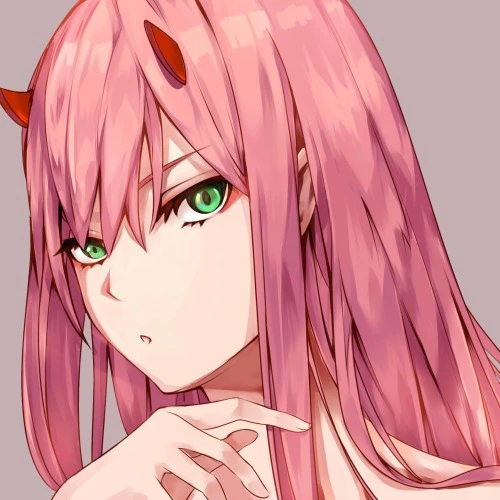

  

<h1 align="center">
  <b>Raven - UserBot</b>
</h1>

<b>A stable pluggable Telegram userbot + Voice & Video Call music bot, based on Telethon.</b>

   

----

### Local / VPS Deploy
- Get your [Necessary Variables](#Necessary-Variables)
- Clone the repository:    
  - `git clone https://github.com/itzNightmare17/Raven.git`
- Go to the cloned folder:
  - `cd Raven`
- Create a virtual env:      
  - `virtualenv -p /usr/bin/python3 venv`

  - `. ./venv/bin/activate`
- Install the requirements:      
  - `pip(3) install -r reso*/star*/optional-requirements.txt`

  - `pip(3) install -r requirements.txt`
- Generate your `SESSION`:
  - From Telegram Bot : [@StringFatherBot](https://t.me/StringFatherBot)
- Fill your details in a `.env` file, as given in [`.env.sample`](https://github.com/itzNightmare17/Raven/blob/main/.env.sample).
(You can either edit and rename the file or make a new file named `.env`.)
- Attach `screen`:
  - `screen -S Raven`
- Run the bot:
  - Linux Users:
    `./raven start`
  - ubuntu users:
    `./raven start`
  - Windows Users:
    `python(3) -m core`
- Detach `screen`:
  - `Ctrl+A` & `Ctrl+D`
---

## Necessary Variables
- `SESSION` - SessionString for your accounts login session. Get it from [here](#Session-String)

One of the following database:
- For **Redis** (tutorial [here](./resources/extras/redistut.md))
  - `REDIS_URI` - Redis endpoint URI, from [redislabs](http://redislabs.com/).
  - `REDIS_PASSWORD` - Redis endpoint Password, from [redislabs](http://redislabs.com/).
- For **MONGODB**
  - `MONGO_URI` - Get it from [mongodb](https://mongodb.com/atlas).
- For **SQLDB**
  - `DATABASE_URL`- Get it from [elephantsql](https://elephantsql.com).

## Session String
Different ways to get your `SESSION`:
* Linux : `wget -O session.py https://git.io/JY9JI && python3 session.py`
* PowerShell : `cd desktop ; wget https://git.io/JY9JI ; python ultroid.py`
* Termux : `wget -O session.py https://git.io/JY9JI && python session.py`
* TelegramBot : [@StringFatherBot](https://t.me/StringFatherBot)

---

# License
   
Raven is licensed under [GNU Affero General Public License](https://www.gnu.org/licenses/agpl-3.0.en.html) v3 or later.

---

# Credits
* [Lonami](https://github.com/LonamiWebs/) for [Telethon.](https://github.com/LonamiWebs/Telethon)
* [MarshalX](https://github.com/MarshalX) for [PyTgCalls.](https://github.com/MarshalX/tgcalls)

> Made with 💕 by [@bad_OreO](https://t.me/bad_oreo).
